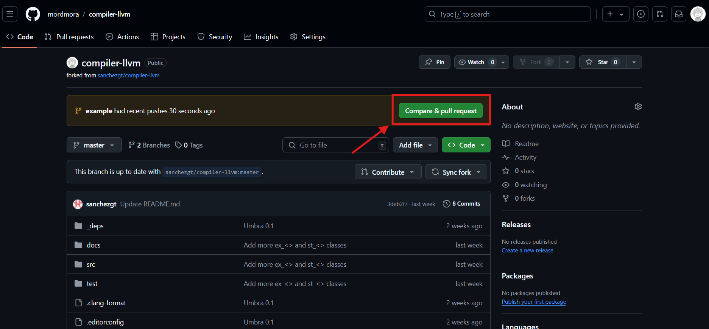

## Como contribuyo?

- Cear un fork
    
    Primero debes crear un fork para hacer una copia del        repositorio en tu lista de repositorios
- Clona el fork:
    
    Clona el fork que hiciste sando el comando  ```git clone <URL repo> ```. Lo encontrarás en tu lista de repositorios de GitHub. Por ejemplo: ```git clone https://github.com/<usuario>/Umbra.git ```
- Crea un Upstream

    Un upstream es basicamente un enlace para mantener el seguimiento desde tu repositorio al repositorio del proyecto original. Para crearlo usa el comando ```git remote add upstream <link del repositorio original>```. Para confirmar que no se ha hecho algun cambio en el repositorio usa el comando ```git pull upstream master```.

- Crea la rama donde vas a trabajar

    Es bueno crear una nueva rama cada vez que quieras contribuir, esto nos permite identificar que la rama es para la contribución que se está a punto de hacer, podría ser tan pequeño como corregir un error tipográfico o tan largo como la implementación de una nueva funcionalidad. De cualquier manera, es buena práctica crear una rama. Otra parte importante de la creación de ramas es el nombrado, es agradable usar un nombre que un extraño que no sabe nada del repositorio pueda entender fácilmente. Si quieres añadir una funcionalidad del lexer o parser, puedes crear la rama con el nombre ```lexer-hexadecimal-support``` por ejemplo. 
    Para crear una rama debes escribir el siguiente comando en tu terminal:

    ```git checkout -b <el nombre de tu rama>```

    Este comando creará una rama y apuntará a ella, si el nombre de la rama es lexer-hexadecimal-support entonces puedes usar el siguiente comando:

    ```git checkout -b lexer-hexadecimal-support```

- Hacer stage y commit

    ```
    // Para hacer stage de los cambios
    git add .

    //Para hacer commit de los cambios
    git commit -m 'Mensaje del commit'
    ```
- Hacer pull desde Upstream a nuestra rama local

    ```git pull upstream <nombre-de-rama>```

- Push de la rama en la que estás trabajando

    Para subir los cambios de la rama en la que estás trabajando debes ejecutar el comando ```git push origin <nombre-de-rama>```

- Crear PR (Pull Request)

    Para abrir un pull request, navega hasta el repositorio principal como puedes ver en la siguiente imagen. Podrás ver la última rama que subiste 'example', entonces debes hacer click en ```'compare and pull request'```.
    
      Antes de hacer el PR, asegurate de explicar claramente los cambios que has realizado en la descripción.

Y es todo.
